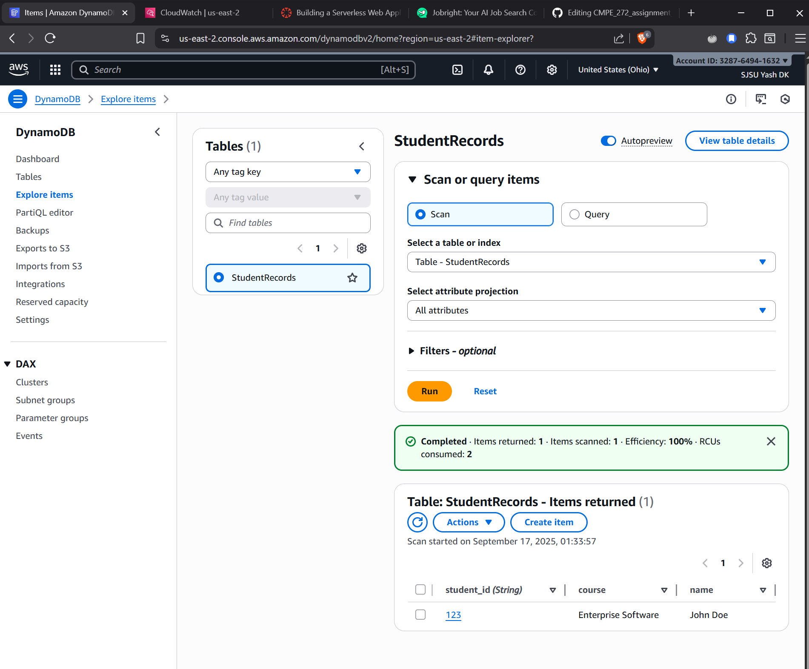
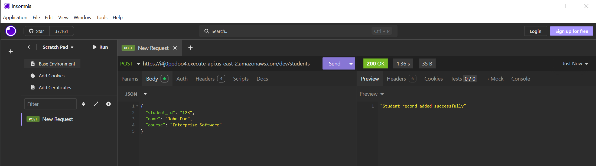
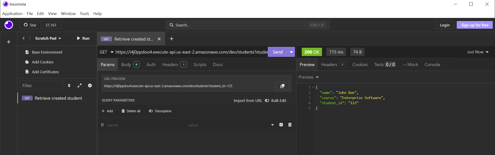

# CMPE_272_assignment_2
Building a Serverless Web Application with AWS Lambda and DynamoDB

### Student Records API

This project uses Amazon Web Services (AWS) to create a basic serverless web application. Using AWS Lambda as a compute service, Amazon DynamoDB as a NoSQL database, and Amazon API Gateway to make a public REST API available, it illustrates a fundamental serverless architecture. Basic features for creating and reading student records are available in the application.

#### 1. DynamoDB Table and Data

This screenshot shows the `StudentRecords` DynamoDB table in the AWS Management Console, confirming that the data from the `POST` request has been successfully written to the database.

#### 2. API Testing Screenshots

These screenshots provide proof that the API is functioning correctly. The `POST` request successfully adds a new student record, and the `GET` request retrieves the same record using its `student_id`.

**Successful POST Request**

This Insomnia (curl client like Postman) screenshot shows the `POST` request and the successful `200 OK` response from the API.

**Successful GET Request**

This screenshot shows the `GET` request with a query parameter and the successful `200 OK` response, confirming that the data was retrieved from the database.

#### 3. Reflection

 - Reading the error logs in CloudWatch was crucial for figuring out what was going wrong behind the scenes. Without them, it would have been impossible to pinpoint the exact issues.
 - The process of connecting the Lambda function to the API Gateway was a core challenge, as the setup had to be precise to get the requests to work.
 - I learned that Lambda functions require specific permissions to interact with other AWS services like DynamoDB. This was a key part of figuring out why some operations weren't working.
 - Sending data with a POST request and then immediately retrieving it with a GET request helped me understand the complete end-to-end flow of the application.
